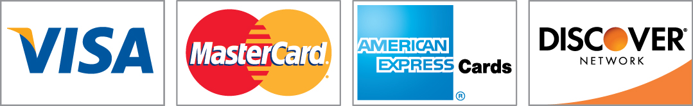

> # Why am I not funded?
A _very_ short talk on open source funding

---

# It's nice to meet you!

Let's learn a bit more about who is here...

<!--
	* Have developers raise hand
  * Any open source maintainers?
	* Have company execs raise hand
	* Have company execs admit they use OSS
	* “You should pay them”
-->

---

# Hi! 👋 I'm Eric Berry

* Gitcoin Co-Founder & CodeFund Lead
* Open Source Collective (OSC) board member
* [@coderberry](https://twitter.com/coderberry) on twitter, github, telegram
* OSS Developer Advocate
* Software developer for 20+ years

---

### Ruby (on Rails)

* Spotify
* Hulu
* Airbnb
* GitHub
* ZenDesk


---

### How to build a blog in 15 minutes


<!--
15 years ago
-->

---


---

#### Ruby Gems

```
gem "css_parser", "1.7.0"
gem "device_detector", "~> 1.0.1"
gem "devise", "~> 4.7.1"
gem "devise_invitable", "~> 2.0.1"
gem "diffy", "~> 3.3.0"
gem "docraptor", "~> 1.3.0"
gem "email_address", "~> 0.1.11"
gem "full-name-splitter", "~> 0.1.2"
gem "gibbon", "~> 3.3.0"
gem "heroku-deflater", "~> 0.6.3"
gem "hiredis", "~> 0.6.3"
gem "htmlentities", "4.3.4"
gem "image_processing", "~> 1.9.0"
gem "import_export", "~> 0.0.1"
gem "inky-rb", "~> 1.3.7.3", require: "inky"
gem "ipaddress", "~> 0.8.3"
gem "jbuilder", "~> 2.5"
gem "jwt", "~> 2.2.1"
gem "liquid", "~> 4.0.1"
gem "mailgun-ruby", "~> 1.2.0"
gem "maxminddb", "~> 0.1.22"
gem "meta-tags", "~> 2.12.0"
gem "mini_magick", "~> 4.9.2"
gem "monetize", "~> 1.9.0"
gem "money", "~> 6.13.1"
gem "money-rails", "~> 1.13.0"
gem "mustache", "~> 1.1.0"
gem "oj", "~> 3.9.0"
gem "okcomputer", "~> 1.18.0"
gem "pagy", "~> 3.7.0"
gem "paper_trail", "~> 10.3.0"
gem "perm", "~> 1.0.2"
gem "pg", ">= 0.18", "< 2.0"
gem "pg_lock", "~> 0.2.1"
gem "premailer", "1.11.1"
gem "premailer-rails", "1.10.3"
gem "pretender", "~> 0.3.3"
gem "puma", "~> 4.3"
gem "rack-attack", "~> 6.2.1"
gem "rails", "~> 6.0"
gem "redis", "~> 4.0", require: ["redis", "redis/connection/hiredis"]
```

---


---


---

<!--
On June 19th, 2017, one hundred people gathered in San Francisco to create a cultural shift in how we think about the sustainability of open source software.
-->

> [The mass adoption of open source] has created a landscape in which the goodwill of a few can no longer sustain the increasing demands the ecosystem places on them.

<br>

\- [The Report](https://medium.com/open-collective/sustainoss-the-report-881e4b12d180), June 2017

---


---

<style scoped>
em {
  color: yellow;
}
</style>


Is sustainability in blockchain development even more important?

_#dudewheresmymoney_

---

<style scoped>
h1 {
  font-size: 30rem;
}
</style>

# 💰

---

### Question
# How do I get funding?

---

### Answer:
# It depends

---


# Meet Charles

---


* Enjoys evening walks alone on the beach
* Extremely opinionated
* Likes to argue
* Enjoys books over people

---


# Meet Bill

---


* Master of bowties
* Social butterfly
* Loves teaching
* Art of simplification

---


# Meet Oprah

---


* Brilliant entrepreneur
* Driven by impact, but master of business 
* Marketing expert

---

# [A handy guide to financial support for open source](https://github.com/nayafia/lemonade-stand)

\- by Nadia Eghbal, author of **Roads and Bridges**

<!--
She lists 17 different categories of funding, along with the pros and cons
-->

---


---

# Donations

Ask for money from others to support the project.


---

### Types of Donations

* Grants
* Sponsorships
* Donations
* Foundations
* Crowdfunding

---

### Examples

* VueJS (Patreon)
* Babel (Open Collective)
* Python Software Foundation
* FOSS Fund
* GitHub Sponsors

---

### Pros

* Low barrier of entry
* Allows developer to focus on code

---

### Cons

* Little to no payout without fund-raising efforts
* May require a large audience

---


---

# Support

Sell time, training material and merchandise


---

### Forms of Support

* Consulting
* Books
* Training videos
* Webinars

---

### Examples

* reacttraining.com (funds React Router)
* DriftingRuby.com
* TideLift
* RedHat

---

### Pros

* Good for project marketing
* Helps keep project aligned with needs

---

### Cons

* Smaller project are not able to do this
* Paid training is rarely in demand
* Can distract from core development

---


---

# Entrepreneur

Sell open source projects via licensing, hosting, etc

<br>



--- 

* Shared Source
* Freemium License
* Dual License
* SaaS / Venture Capital
* Open Core

---

### Examples

* Discourse
* MySQL
* Gatsby
* Sidekiq

---

### Pros

* Can scale well if successful
* Has potential to provide full-time income

---

### Cons

* Smaller OSS projects don’t benefit
* Can distract from core development

---


---

# There is no wrong answer

---

# 1 + 1 + 1 = 10

<!--

It's common to combine multiple forms of funding to open source.

-->

---

# Web3

<!--

Discuss potential for disruption by web3 tech

-->

---

# Questions?

* [@coderberry](https://twitter.com/coderberry) on twitter, github, telegram
* [SustainOSS.org](https://sustainoss.org)
* [Lemonade Stand](https://github.com/nayafia/lemonade-stand#venture-capital)
* [oss.fund](https://oss.fund)
* [Slides]()

---